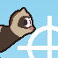
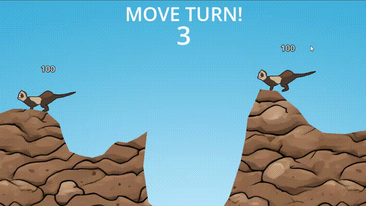

<!-- PROJECT LOGO -->

  

    
  

<h3 align="center">Fretkers</h3>

  A Worms inspired turn-based game featuring ferrets battling each other.
  

    
  <h2 align="center">
    <a href="https://fuczek.itch.io/fretkers">View Demo</a>
         
         
      </h2>
  

<!-- ABOUT THE PROJECT -->
## About The Project

The project is a variant of turn-based gameplay with a twist. Players have dedicated turns for moving and shooting separately, as well as action turn for showing the aftermath of their actions.

This project features destructible 2D environment, a bazooka-type weapon and a 3D animated character made in Blender, which was then exported as a spritesheet. Controls: WASD and arrows for the other player.

Project is a prototype that I hope to soon or later revisit.

### Built With

Godot 4.2 using GDScript

<!-- GETTING STARTED -->
## Getting Started

To get a local copy up and running clone the repo and open it in a Godot Engine 4.2. There are no additional steps.
